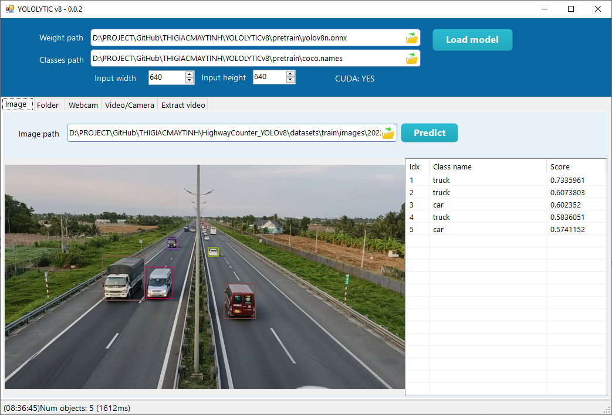

# YOLOLYTICv8

Phần mềm kiểm thử độ chính xác Object Detection YOLO v8. Chương trình chạy trên Windows 10 x64, có hỗ trợ CUDA.

- CUDA 11.8
- cuDNN 8.6.0

## Chức năng

1. Detect object trong ảnh tĩnh

2. Detect object trong folder

3. Detect object trong webcam

4. Detect object trong video hoặc camera stream

5. Extract camera frame và bouding box
Dùng để retrain